<!-- PROJECT LOGO -->
<br />
<p align="center">
  <a href="https://github.com/OmarYehia/django-social_network">
    
  </a>

  <h3 align="center">The Social Network</h3>

  <p align="center">
    Django social media project for (ITI - Open Source Applications Development - intake 41) 
    <br />
    <a href="https://github.com/OmarYehia/django-social_network"><strong>Explore the docs »</strong></a>
    <br />
    <br />
  </p>
</p>


<!-- TABLE OF CONTENTS -->
<details open="open">
  <summary>Table of Contents</summary>
  <ol>
    <li>
      <a href="#about-the-project">About The Project</a>
      <ul>
        <li><a href="#built-with">Built With</a></li>
      </ul>
    </li>
    <li>
      <a href="#getting-started">Getting Started</a>
      <ul>
        <li><a href="#prerequisites">Prerequisites</a></li>
        <li><a href="#installation">Installation</a></li>
      </ul>
    </li>
    <li><a href="#usage">Usage</a></li>
    <li><a href="#permissions">Permissions</a></li>
    <li><a href="#contributing">Contributing</a></li>
    <li><a href="#license">License</a></li>
    <li><a href="#contact">Contact</a></li>
  </ol>
</details>


<!-- ABOUT THE PROJECT -->
## About The Project
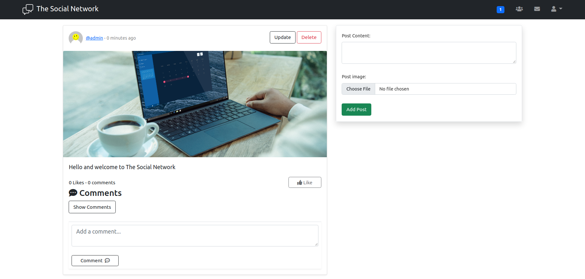


This is a functional social media application where users can signup and communicate together. The user can:
* Create posts with images
* Add friends and send them messages
* Comment on posts
* Create groups and manage them

and a lot of other features!

### Built With

This section should list any major frameworks that you built your project using. Leave any add-ons/plugins for the acknowledgements section. Here are a few examples.
* [Bootstrap5](https://getbootstrap.com)
* [Django](https://www.djangoproject.com/)


<hr>
<!-- GETTING STARTED -->
## Getting Started


### Prerequisites

* You should have Python installed on your machine

### Installation

1. Clone the repo
   ```sh
   git clone https://github.com/OmarYehia/django-social_network.git
   ```
2. Create a virtual environment, example:
   ```sh
   python3 -m venv env
   ```
   note: You can use any python version instead of python3

3. Activate the virtual environment
   ```sh
    source env/bin/activate
   ```
   note: 
   * `env` is the name of the folder you created in step 2
   * If you're using windows please check Python's documentation on how to activate the virtual environment there

4. Install the required dependencies
    ```sh
    pip install -r requirements.txt
    ```

<hr>

<!-- USAGE EXAMPLES -->
## Usage

* Home page before you login
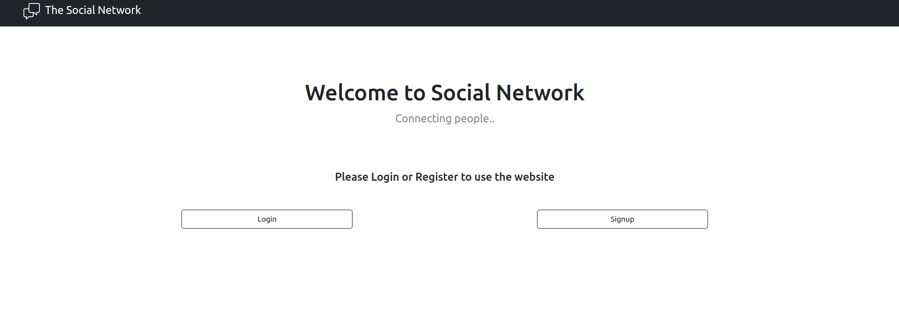

* You main post feed


* Profiles
    * Your profile
    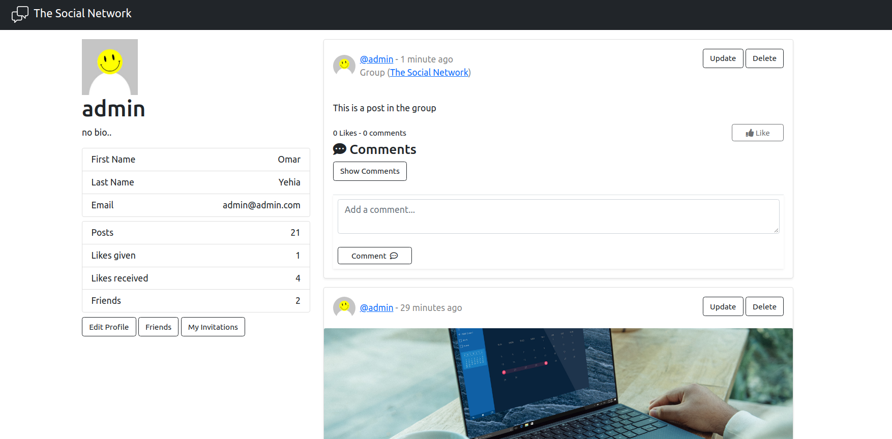

    * Others Profile
    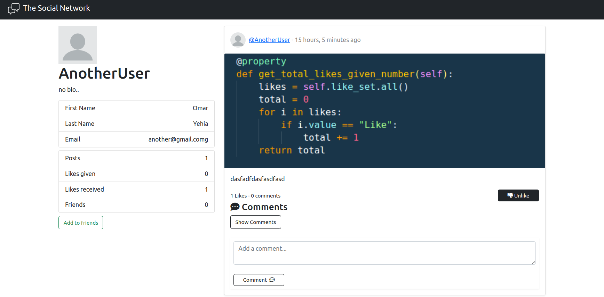

* Groups
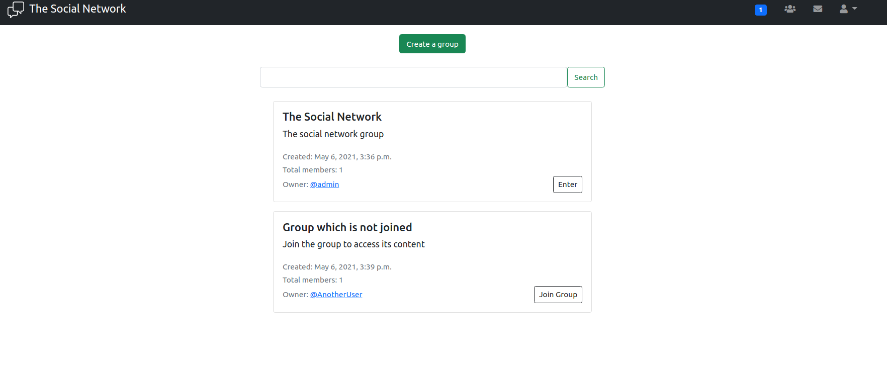
    
    * Search a group which is not found
    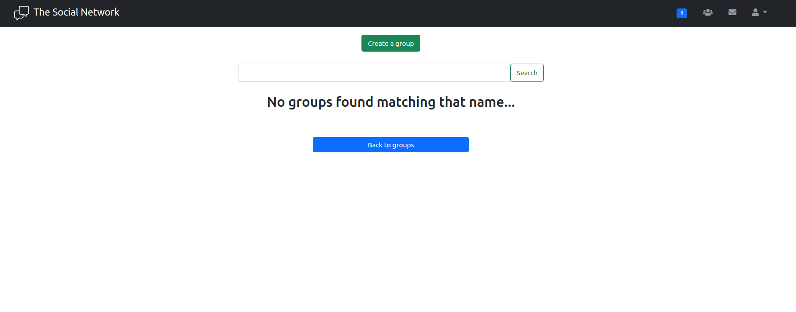

    * Group from inside
    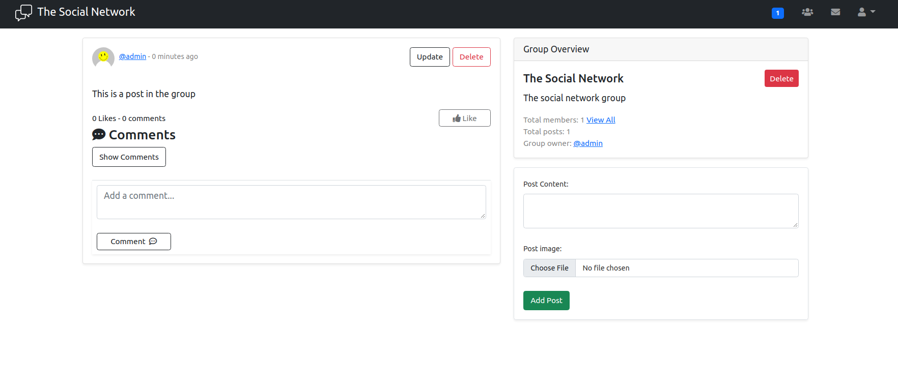

    * Group members
    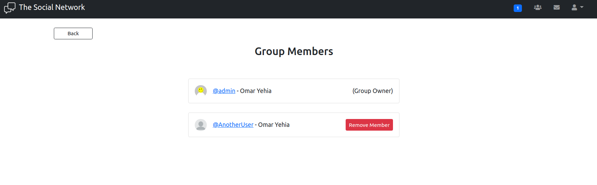

* Messages (You can only send messages to your friends)
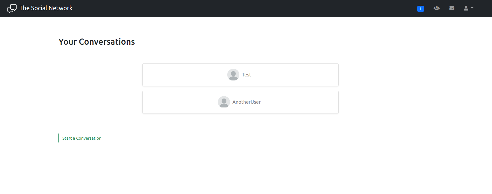
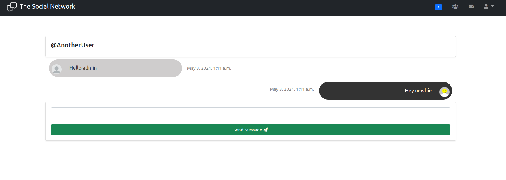

* Profanity checks with the ability to add custom words to ban
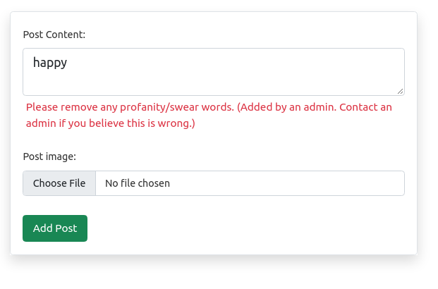

* Norifications
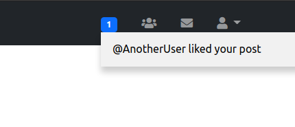

<!-- 

## Permissions

1. Unauthenticated users can only access homepage, login or signup pages
2. User
    * Can only see their, their friends' and the group they're part of posts on his posts feed
    * Can create posts 
    * Can edit posts
    * Can view other members profiles and their posts in them
    * Can only edit his own profile
    * Can like any post (except his own)
    * Can comment on any post
    * Can delete only his comments
    * Can only delete his own posts or posts from the group he manages
    * Can create groups
    * Can join groups
    * Can search for groups by name
    * Can remove members from groups they own
    * Can send friend request to members
    * Can send messages to another user (only if they're in friends list)
    * Can see his notification panel
3. Posts
    * Cannot contain profanity words(applies to custom profanity)
    * Cannot have an empty body
    * Can add images to the posts -->


<!-- CONTRIBUTING -->
## Contributing

Contributions are what make the open source community such an amazing place to be learn, inspire, and create. Any contributions you make are **greatly appreciated**.

1. Fork the Project
2. Create your Feature Branch (`git checkout -b feature/AmazingFeature`)
3. Commit your Changes (`git commit -m 'Add some AmazingFeature'`)
4. Push to the Branch (`git push origin feature/AmazingFeature`)
5. Open a Pull Request


<!-- LICENSE -->
## License

Distributed under the MIT License. See `LICENSE` for more information.


<!-- CONTACT -->
## Contact

Amira Sakr - [Linkedin](https://www.linkedin.com/in/amira-sakr/) - [Github](https://github.com/AmiraAbdelRaoufSakr) - amira.21sakr@gmail.com <br>

Abdelfatah Hezema - [Linkedin](https://www.linkedin.com/in/abd-elfatah-hezema/) - [Github](https://github.com/Abdelfatahh) - abdelfatahhezema@gmail.com <br>

Yehia Khalil - [Linkedin](https://www.linkedin.com/in/yehiakhalil/) - [Github](https://github.com/yehia-khalil) - yehiakhalilykk@gmail.com <br>

Omar Yehia - [Linkedin](https://www.linkedin.com/in/omar-yehia94/) - [Github](https://github.com/OmarYehia) - abdelfatahhezema@gmail.com <br>

Project Link: [https://github.com/OmarYehia/django-social_network](https://github.com/OmarYehia/django-social_network)